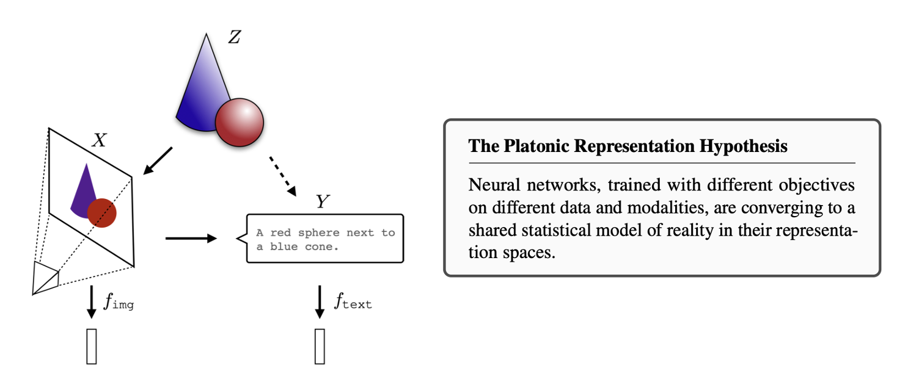

# Awesome Platonic Representation Hypothesis Papers 

A curated collection of research papers related to the Platonic Representation Hypothesis (PRH).

  

## Table of Contents

- [How to Contribute](#how-to-contribute)
- [Survey](#survey)
- [Papers](#papers)
- [Talks](#talks)

## How to Contribute

We welcome contributions that enhance and expand this collection. Please see our [contribution guidelines](how-to-PR.md) for details on how to submit a pull request.

## Survey

**[Large Vision-Language Model Alignment and Misalignment: A Survey Through the Lens of Explainability](https://arxiv.org/abs/2501.01346)**  
*Dong Shu, Haiyan Zhao, Jingyu Hu, Weiru Liu, Ali Payani, Lu Cheng, Mengnan Du*  
Arxiv 2025 | [github](https://github.com) | [bibtex](citations/VLM-alignment-and-misalignment.txt)

## Papers

**[The Platonic Representation Hypothesis](https://arxiv.org/abs/2405.07987)**  
*Minyoung Huh, Brian Cheung, Tongzhou Wang, Phillip Isola*  
ICML 2024 (Position Paper, Oral) | [github](https://github.com/minyoungg/platonic-rep) | [bibtex](citations/prh.txt)

<strong>Empirical Evidence Supporting PRH</strong>

**[Representation Alignment for Generation](https://arxiv.org/abs/2410.06940)**  
*Sihyun Yu, Sangkyung Kwak, Huiwon Jang, Jongheon Jeong, Jonathan Huang, Jinwoo Shin, Saining Xie*  
ICLR 2025 (Oral) | [github](https://github.com/sihyun-yu/REPA) | [bibtex](citations/repa.txt)

- - - -

**[Neuron Platonic Intrinsic Representation From Dynamics Using Contrastive Learning](https://arxiv.org/abs/2502.10425)**  
*Wei Wu, Can Liao, Zizhen Deng, Zhengrui Guo, Jinzhuo Wang*  
ICLR 2025 | [github](https://github.com/ww20hust/NeurPIR) | [bibtex](citations/NeurPIR.txt)

- - - -

**[It's a (Blind) Match! Towards Vision-Language Correspondence without Parallel Data](https://www.arxiv.org/abs/2503.24129)**  
*Dominik Schnaus, Nikita Araslanov, Daniel Cremers*  
CVPR 2025 | [github](https://github.com/dominik-schnaus/itsamatch) | [bibtex](citations/blend_match.txt)

- - - -

**[Shared Global and Local Geometry of Language Model Embeddings](https://arxiv.org/abs/2503.21073)**  
*Andrew Lee, Melanie Weber, Fernanda Viégas, Martin Wattenberg*  
Arxiv 2025 | [github](https://github.com/dominik-schnaus/itsamatch) | [bibtex](citations/share_global_local.txt)

- - - -

**[Linguistic Minimal Pairs Elicit Linguistic Similarity in Large Language Models](https://arxiv.org/abs/2409.12435)**  
*Xinyu Zhou, Delong Chen, Samuel Cahyawijaya, Xufeng Duan, Zhenguang G. Cai*  
COLING 2025 | [github](https://github.com/ChenDelong1999/Linguistic-Similarity) | [bibtex](citations/Linguistic-Similarity.txt)

<strong>Theoretical Foundations for PRH</strong>

**[Towards a Learning Theory of Representation Alignment](https://arxiv.org/abs/2502.14047)**  
*Francesco Insulla, Shuo Huang, Lorenzo Rosasco*  
ICLR 2025 | [bibtex](citations/learning_theory_ra.txt)

<strong>Extension to Neuroscience and Biological Systems</strong>

**[Universality of Representation in Biological and Artificial Neural Networks](https://pmc.ncbi.nlm.nih.gov/articles/PMC11703180/)**  
*E Hosseini, C Casto, N Zaslavsky, C Conwell, M Richardson, E Fedorenko*  
bioRxiv 2024 | [bibtex](citations/rep_bio_ai.txt)

<strong>Analysis and Limitations of PRH</strong>

**[Understanding the emergence of multimodal representation alignment](https://arxiv.org/abs/2502.16282/)**  
*Megan Tjandrasuwita, Chanakya Ekbote, Liu Ziyin, Paul Pu Liang*  
ICLR Re-Align Workshop 2025 | [github](https://github.com/MeganTj/multimodal_alignment) | [bibtex](citations/understand_multimodal_rep.txt)

- - - -

**[Intriguing Properties of Large Language and Vision Models](https://arxiv.org/abs/2410.04751)**  
*Young-Jun Lee, Byungsoo Ko, Han-Gyu Kim, Yechan Hwang, Ho-Jin Choi*  
Arxiv 2024 | [github](https://github.com/passing2961/IP-LLVM) | [bibtex](citations/IP-LLVM.txt)

## Talks

**[The Platonic Representation Hypothesis](https://www.youtube.com/watch?v=1_xH2mUFpZw)**  
*Phillip Isola, Simons Institute, June 2024.*  
[slides](https://www.dropbox.com/scl/fi/p2l67t6kl9xzsome2pt05/platonic_rep_simons2024.pdf?rlkey=y80epgc4bofyifmu46hgq5yvi&e=1&dl=0)

## License
MIT
